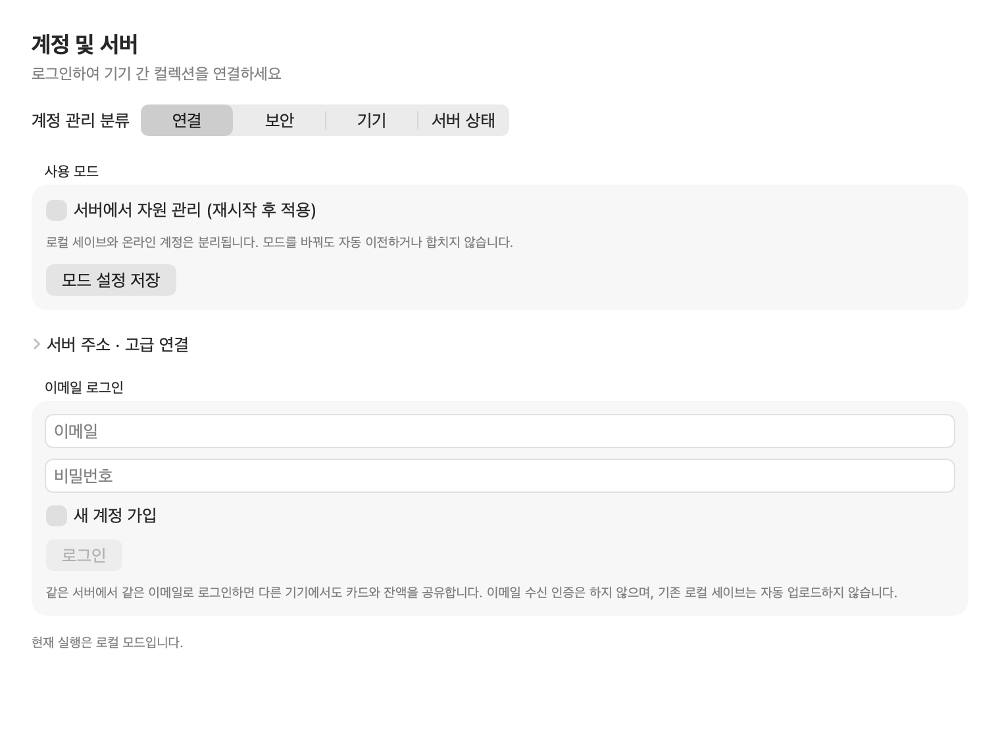
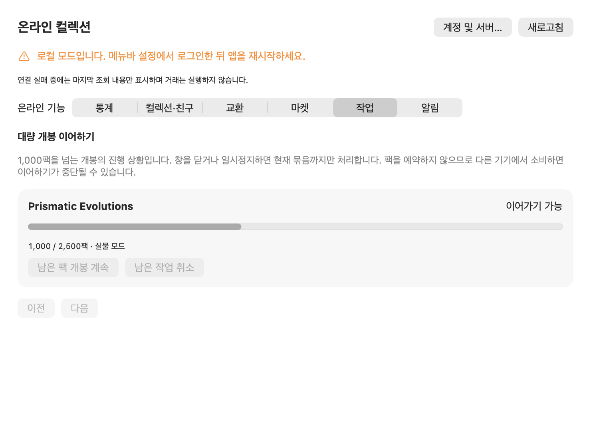

# PokePackBar

AI 코딩 도구로 태운 토큰을 포켓몬 카드팩으로 바꿔 주는 macOS 메뉴바 앱.

코딩하면 토큰이 쌓이고, 쌓인 토큰으로 카드팩을 산다. 팩을 뜯어 카드를 모은다.

## 어떻게 동작하나

Claude Code, Codex, Gemini CLI 등 11개 도구의 로컬 로그에서 사용량을 읽는다.
로컬 모드는 사용량을 기기 안에서 처리한다. 온라인 계정을 연결하면 누적 사용량과
게임 명령을 서버로 보내 카드·팩·재화를 기기 사이에서 공유한다. 공급자 원본 로그와
인증 토큰은 서버로 보내지 않는다.

- **상점** — 세트별 카드팩을 산다(1999년 초판부터 최신 세트까지 127종).
  **오리파**는 여러 세트의 상위 등급만 골라 담은 40봉투짜리 박스다. 안에 무엇이 남았는지
  전부 보이고, **봉투를 직접 골라** 연다. 연 봉투의 카드는 박스에서 빠지고, 값은 남은
  봉투에 따라 바뀐다
- **팩** — 산 팩을 뜯는다. 한 장씩 크게 나오고, 등급에 따라 카드 뒤에서 빛이 퍼진다.
  세트별 슬롯과 판형 규칙을 사용하며, **갓팩**은 지원되는 제품별 규칙에 따라 나온다.
  보유 팩 수량을 입력해 한 번에 개봉할 수 있다
- **컬렉션** — 모은 카드를 본다. 세트와 등급으로 거르고, 눌러서 크게 본다.
  크게 본 카드는 마우스로 기울일 수 있고, 기울이는 방향에 따라 광택이 흐른다
- **도감** — 카드 몇 장을 묶은 조합을 완성한다. 「불꽃도마뱀의 성장기」, 「로켓단 독가스반」처럼
  다양한 조합이 있고, 다 모으면 팩과 영구 혜택(적립 증가·팩 할인 등)을 받는다

공식 사용 한도(5시간·주간)를 다 채우면 세트별 팩값에 맞춘 보너스 팩을 받는다.

등급은 국내 커뮤니티에서 쓰는 약칭을 따른다 — C · U · R · RR · RRR · AR · SR · SAR · UR.

## 설치

```bash
brew tap wonyangs/tap
brew trust --cask wonyangs/tap/poke-pack-bar
brew install --cask poke-pack-bar
```

가운데 `brew trust` 는 건너뛸 수 없다. Homebrew 가 서드파티 tap 의 cask 를
기본으로 거부하므로, 없으면 설치가 막힌다.

macOS 14 이상.

업데이트는 앱 안의 업데이트 버튼을 누르거나 아래를 실행한다.

```bash
brew update
brew upgrade --cask poke-pack-bar
```

`brew update` 를 빼면 안 된다. Homebrew 는 tap 을 하루에 한 번만 다시 받으므로,
없으면 로컬에 남은 옛 cask 를 보고 "이미 최신" 이라고 답한다.

## 온라인 계정과 기존 데이터 이전

설정의 **계정 및 서버**에서 기본 주소 `https://ppb-api.wonyangs.com`을 사용한다.
온라인 서버는 초대제로 운영하며, 가입에는 운영자가 발급한 연결 코드가 필요하다.
기존 사용자는 먼저 앱을 종료하고 `~/Library/Application Support/PokePackBar/game-state.json`
이전을 운영자와 진행한다. 원본 로그나 공급자 로그인 정보는 보내지 않는다.

운영자가 기존 상태를 가져온 뒤 발급한 코드를 가입 화면의 **기존 UUID 계정 연결**에
입력하고 이메일·비밀번호를 등록한다. 로그인 후 앱을 재시작하면 서버 상태로 연결된다.
다른 Mac에서는 같은 계정으로 로그인만 한다. 세이브는 자동 업로드하거나 합치지 않는다.

온라인에서는 통계·친구·교환·마켓·알림과 대량 개봉 작업을 별도 창에서 사용할 수 있다.
서버 연결이 끊기면 저장된 상태를 볼 수 있지만 구매·개봉·거래는 연결 복구 후 처리한다.
원래 로컬 세이브는 보존되며, 온라인과 로컬 플레이 결과를 나중에 자동 합산하지 않는다.




## 개발

```bash
swift build          # 빌드
swift test           # 테스트
./scripts/build-app.sh   # .app 조립 후 /Applications 설치
```

배포 절차는 [RELEASE.md](RELEASE.md), 코드 규약은 [CLAUDE.md](CLAUDE.md).

카드·팩 이미지는 앱에 넣지 않고 CloudFront에서 필요한 저화질·고화질 파일을 받아
로컬에 캐시한다. 카드 목록과 이미지 무결성·홀로 효과용 메타데이터만 번들에 들어 있다.

## 출처와 라이선스

[chattymin/PokeTokenBar](https://github.com/chattymin/PokeTokenBar) 에서 갈라져 나왔다.
사용량을 읽는 부분은 원본의 것을 쓰고, 포켓몬 육성 기능을 걷어낸 자리에 카드 게임을 넣었다.
MIT 라이선스이며 원저작권 고지를 유지한다.

카드 데이터는 [Pokémon TCG API](https://pokemontcg.io), 팩 아트는
[Pokemon Symbols](https://pokesymbols.com) 를 출처로 한다.

비공식 비상업 팬 프로젝트다. Pokémon 과 관련 상표는 The Pokémon Company International 의 것이다.
